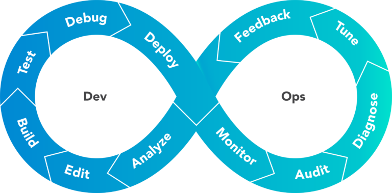
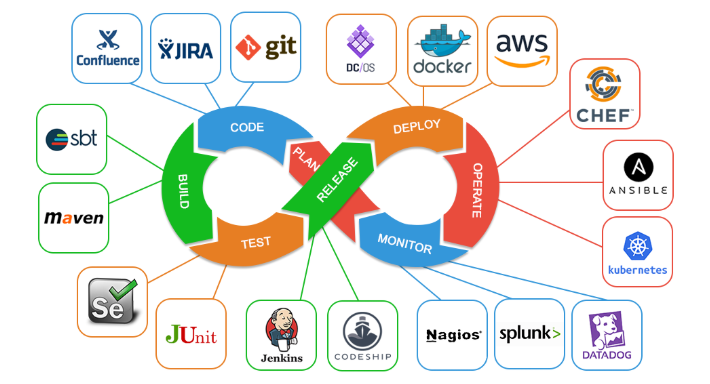

Full Stack Development Environment
======================================

虚拟化一站式DevOps开发环境

## Goals
基于Vagrant和VirtualBox建立一站式DevOps研发环境，以学习DevOps理念并练习相关开源组件的使用。

## Components

### 源码管理

- git

### 制品管理

- Nexus

- JForg Artifactory

- Docker Registry

### 配置管理
- Ansible
- Chef
- Puppet

### 数据库自动化

- [Flyway](https://flywaydb.org/)

- [Liquebase](https://www.liquibase.org/)

### 测试
- JUnit
- TestNG
- Selenium
- Jest
- Mocha
- Jasmine

### 持续集成
- Jekniks
- Banboo
- Teamcity

### 监控
- Prometheus
- Grafana
- Zabbix
- Zipkin
- SkyWalking

### 分析

- ELK

### 智能运维

TBD

### 协作

- JIRA
- Confluence

## TODO

- [ ] Vagrant虚拟化服务器
- [ ] K8S
- [ ] istio
- [ ] Jenkins部署流水线